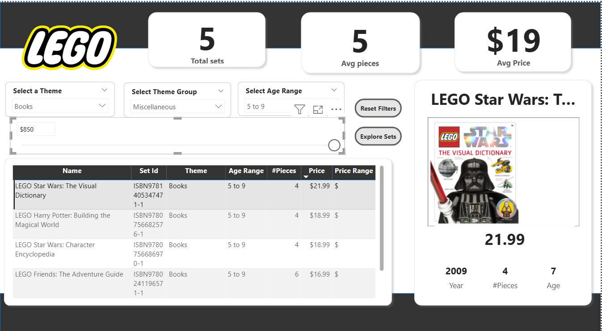
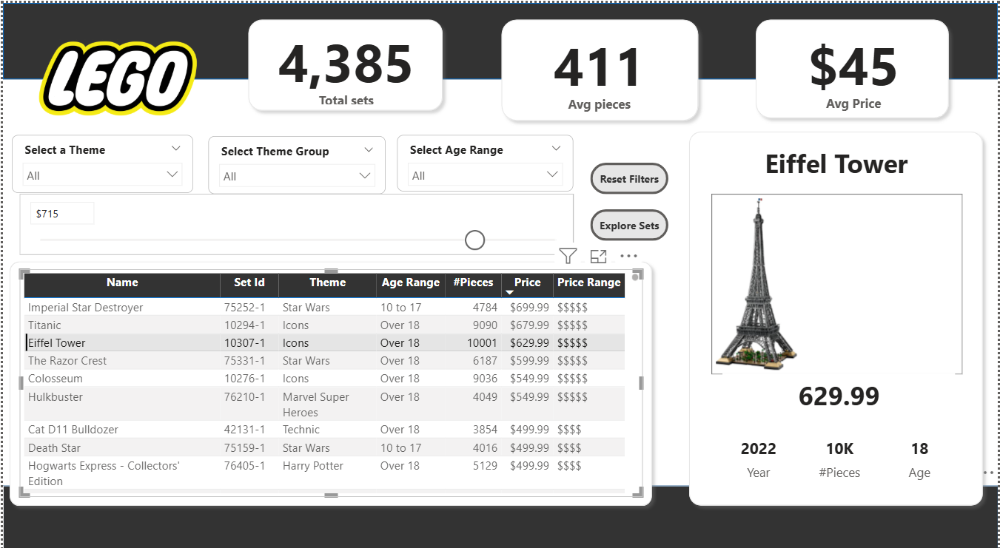
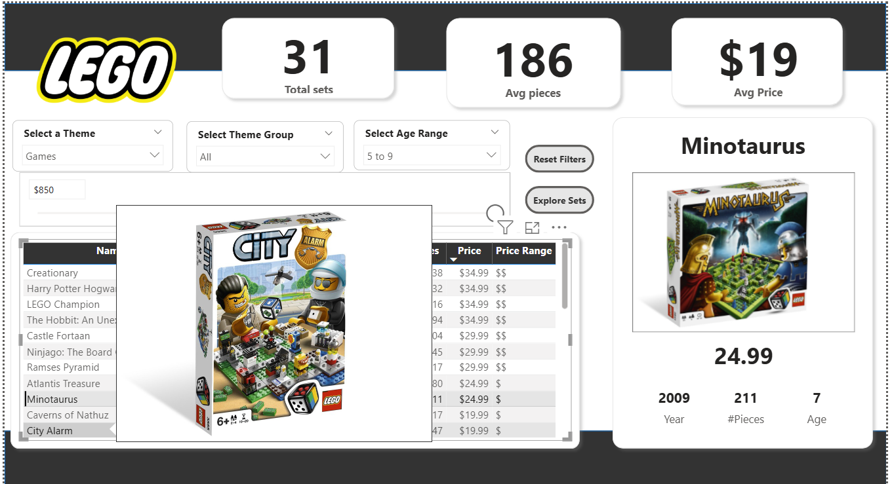
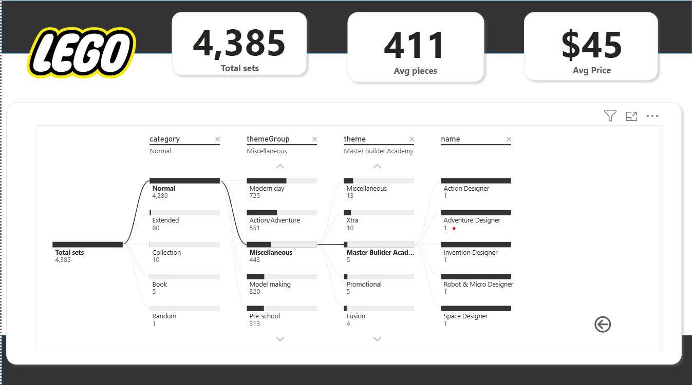

# LEGO Sets Explorer

A fully interactive Power BI dashboard that analyzes LEGO sets across various themes, age groups, and price points. This project explores the dataset from a business intelligence perspective, leveraging DAX measures, conditional logic, and Power BI UX features to uncover insights.

**Domain**: Toys & Games  
**Tools**: Power BI Desktop  
**Dataset**: [LEGO Sets CSV](./lego-sets-data/lego_sets.csv) *(source reference - [Maven Analytics](https://app.mavenanalytics.io/guided-projects/7ea2d5de-8a63-4c92-8350-b640d6df07d4))*  
<br>

## Objective

To create a user-friendly and interactive Power BI dashboard that helps LEGO enthusiasts explore available products and make informed purchasing decisions. The dashboard allows users to filter LEGO sets by age range, theme, price, and other attributes, compare set features, and dive into product-level details through visual insights.

This project simulates a real-world consumer-facing BI tool aimed at enhancing product discovery and decision-making.
<br>

## Key Tasks Performed

### 1. Data Preparation  
- Imported the raw `lego_sets.csv` file into Power BI  
- Removed unnecessary columns: `minifigs`, `bricksetURL`, `thumbnailURL`  
- Filtered out records with missing values for:
  - Price  
  - Age recommendation  
  - Number of pieces  
  - Image URL  
- Created custom conditional columns:
  - **Age Range**: `1 to 4`, `5 to 9`, `10 to 17`, `Over 18`  
  - **Price Range**:  
    ```
    > $500     → $$$$$  
    > $100     → $$$$  
    > $50      → $$$  
    > $25      → $$  
    ≤ $25      → $
    ```
- Added DAX measures for key KPIs:
  - `Total Sets`
  - `Total Theme Groups`
  - `Average Age`
  - `Average Price`
  - `Average Pieces`

### 2. Report Design & Visuals

- Created a high-level KPI panel (card visuals) for:
  - Total Sets  
  - Avg. Pieces  
  - Avg. Price  
- Used filters for:
  - Theme Group  
  - Theme  
  - Age Range  
- Designed a tabular view with key attributes:
  - Name, Set ID, Theme, Age Range, Pieces, Price, Price Range  
- Created a dynamic **detail section** showing:
  - Set image, name, price, year, age, pieces  
  - Configured logic to show data only when one row is selected
- Controlled cross-filtering behavior using **Edit Interactions**
  - Prevented selection in table from affecting KPI cards

**Screenshots**  
| Filtered View | Detail Panel |
|--|--|  
|  |  |

---

### 3. Interactive Features

- Created a numeric parameter **Max Price** using `What-If Parameter`
  - Integrated it into a slicer  
  - Created a DAX filter to show only records within price limit  
- Enabled **Tooltips** to show set thumbnails on hover  
- Added **Bookmark** buttons:
  - "Reset Filters" button resets all slicers to default  
  - Customized hover and pressed states  
- Built a secondary **Decomposition Tree** report page
  - Breakdown of Total Sets by:
    - Category → Theme Group → Theme → Set Name  
  - Added **Page Navigation** buttons

**Screenshots**  
| Tooltip on Hover | Decomposition Tree |  
|--|--|  
|  |  |

---

## Skills & Concepts Demonstrated

| Category          | Highlights                               |
|------------------|-------------------------------------------|
| Data Cleaning     | Column removal, null filtering            |
| Data Modeling     | DAX measures, calculated columns          |
| UX/UI Design      | Custom layout, conditional logic          |
| Interactivity     | Tooltips, slicers, buttons, bookmarks     |
| Visualization     | Cards, tables, images, decomposition tree |

---

## Download the Report

You can explore the interactive Power BI report using the `.pbix` file below:

**PBIX File:** [Download LEGO Power BI Report (.pbix)](./lego-explorer.pbix)  

> **Note:** This file requires [Power BI Desktop](https://powerbi.microsoft.com/desktop/) to open. The report uses **simulated data** for learning/demo purposes only.
<br>

## How to Use

1. Download and install Power BI Desktop if you haven’t already.
2. Open the `.pbix` file using Power BI Desktop.
3. Use the interactive slicers, buttons, and visuals to explore LEGO product trends by age, price, and theme.
