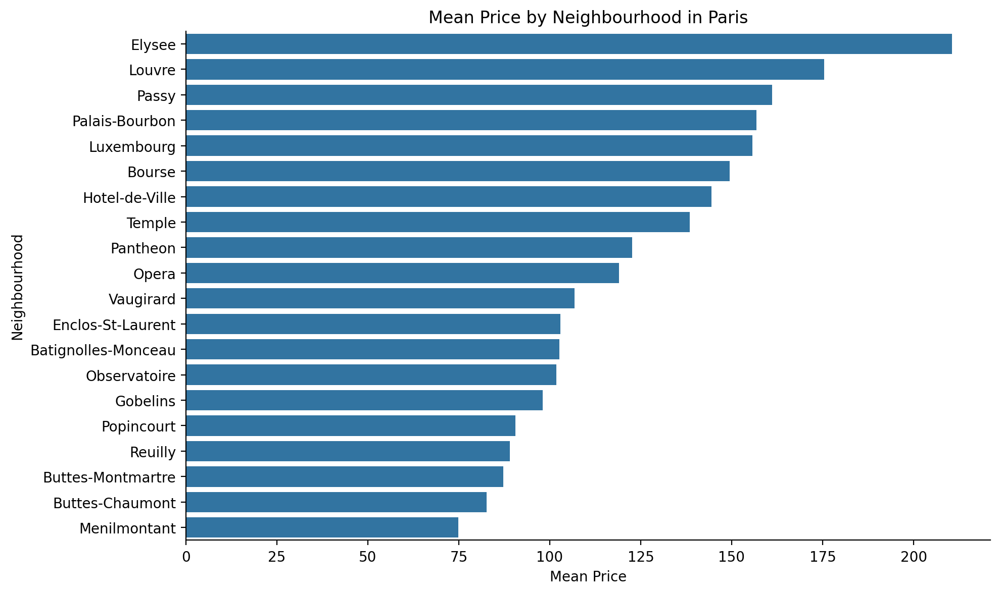
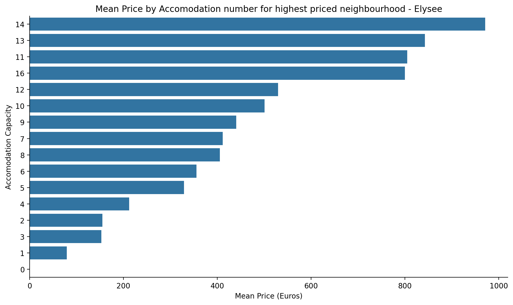
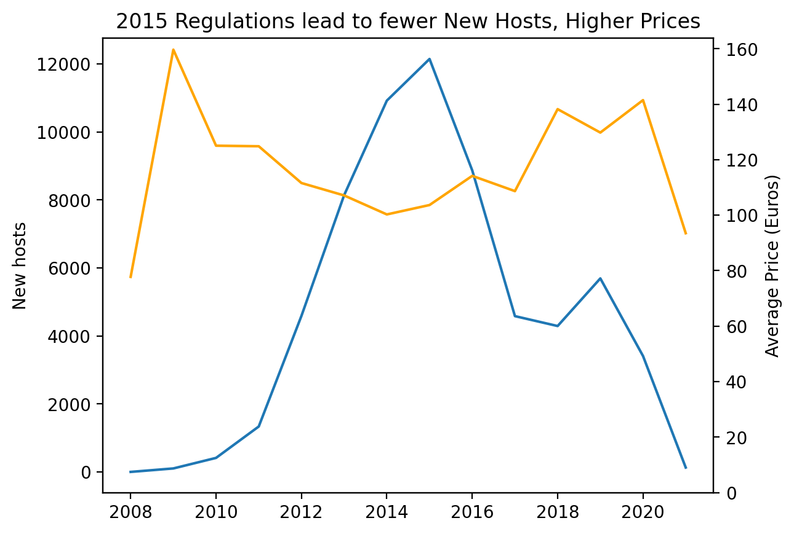

# Airbnb Paris Listings – Basic EDA

### Quick Links:
- ▶️ Notebook: [AirBnb-Listings-Analysis.ipynb](./AirBnb-Listings-Analysis.ipynb)  
- 👀 View in NBViewer: [Click Here](https://nbviewer.org/github/SarikaP22/Data-Analysis-Portfolio/blob/main/Python/AirBnb-Listings-Analysis/AirBnb-Listings-Analysis.ipynb)
- 🧪 Open in Colab: [Click Here](https://colab.research.google.com/github/SarikaP22/Data-Analysis-Portfolio/blob/main/Python/AirBnb-Listings-Analysis/AirBnb-Listings-Analysis.ipynb)


### Project Overview
This project performs a focused exploratory analysis of **Airbnb listings in Paris**. The goal is to demonstrate an end-to-end, beginner-friendly workflow in Python—from loading and profiling the data, to preparing small summary tables for visuals, and presenting clear, lightweight findings. All work is contained in **`AirBnb-Listings-Analysis.ipynb`**.
<br>

### Data Source

**Dataset:** Airbnb Listings (Paris subset used in this analysis) - A total of 270K rows

**Description:** Listing-level data including host start date, location fields, capacity, and price.

**Original Source:** This project uses a publicly available dataset. You can download the complete dataset from [here](https://app.mavenanalytics.io/guided-projects/4fee7ee7-4c04-46e7-9f3e-99b987980842) <br>
**Note:** Due to the large size of the dataset, it is not included in this repository.
<br>

### Methodology

The analysis was organized into three objectives to keep the workflow simple and reproducible.

#### Objective 1: Profile & QA the Data

- Imported `Listings.csv`.
- Cast date columns to proper **datetime**.
- Filtered to **Paris** rows and retained five columns: `host_since`, `neighbourhood`, `city`, `accommodates`, `price`.
- Performed basic QA: checked **missing values** and computed **min / max / average** for numeric fields.  

#### Objective 2: Prepare the Data for Visualization

- **`paris_listings_neighbourhood`**: grouped by `neighbourhood`, calculated **mean price** (sorted low → high).
- **`paris_listings_accomodations`**: identified the **most expensive neighbourhood**, grouped by `accommodates`, calculated **mean price** (sorted low → high).
- **`paris_listings_over_time`**: extracted **year** from `host_since`, then computed **average price** and **count of new hosts** by year.  

#### Objective 3: Visualize the Data and Summarize Findings

- **Horizontal bar charts** for:
  - average price by **neighbourhood** (Paris only)
  - average price by **`accommodates`** within the **most expensive neighbourhood**
- **Line charts** for:
  - **count of new hosts** over time
  - **average price** over time
- **Dual-axis line chart** showing both series together.
- Added brief commentary on how **2015 regulations** may relate to new host counts and prices.
<br>

### Results (Charts)

- **Average price by neighbourhood (Paris)**
<p align="center">
<br>
<sub><em>Average prices vary across Paris; central neighbourhoods tend to be the most expensive.</em></sub>
</p>
  
- **Average price by accommodates — Elysee (most expensive neighbourhood)**
<p align="center">
<br>
<sub><em>Within Elysee, listings that accommodate more guests generally command higher average prices.</em></sub>
</p>

- **New Hosts and Average price by Year (Paris)**
<p align="center">
<br>
<sub><em>Post-2015, new host counts decline while average prices level off, indicating a regulatory effect on supply and pricing.</em></sub>
</p>


### Key Findings

- **Regulations Impacted Growth:** Following the introduction of the **2015 regulations**, there was a noticeable decline in the **number of new hosts** entering the market. This suggests a direct correlation between the new rules and a **slower rate of market expansion**.
- **Average Price Stabilization:** The analysis shows that the **average price per rental stabilized** after the new policies were enacted. This indicates the regulations likely **curbed price volatility** and helped prevent continuous increases.
- **Data-quality notes:** `host_since` had a **very small share of nulls (<0.05%)** and was left as-is for this basic pass; `name` contained some nulls but is **not used** in this analysis.

> See the notebook for the exact counts, charts, and short commentary accompanying these points.
<br>

### Technologies Used

**Language:** Python  
**Libraries:** pandas, numpy, matplotlib (and/or seaborn)  
**Environment:** Jupyter Notebook
<br>

### How to Run This Project

1. Clone the repository and place your CSV at `Airbnb Data/Listings.csv` (or update the path in the notebook).
2. Install dependencies:

   ```bash

   pip install pandas numpy matplotlib seaborn jupyter

### Limitations
- **Paris-only scope:** Findings are specific to Paris listings and may not generalize to other markets.
- **Snapshot effects:** The dataset may not fully capture seasonal dynamics or the most recent pricing changes.
- **QA assumptions:** Minor assumptions for missing values and potential outliers are documented in the notebook.
